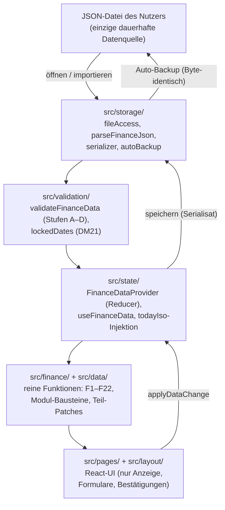
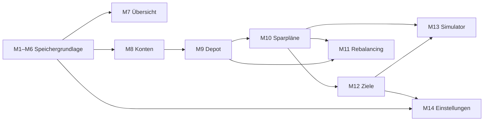
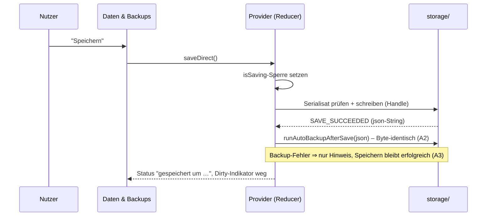
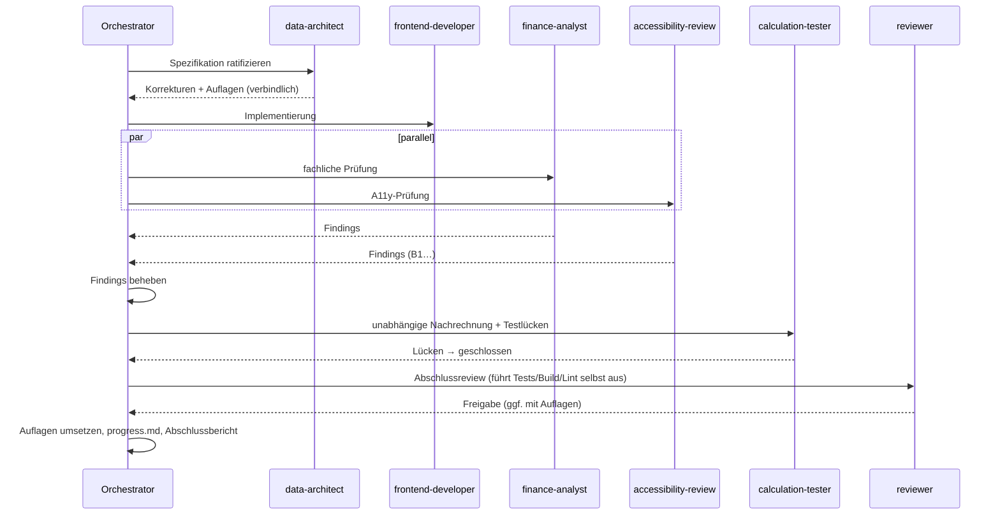
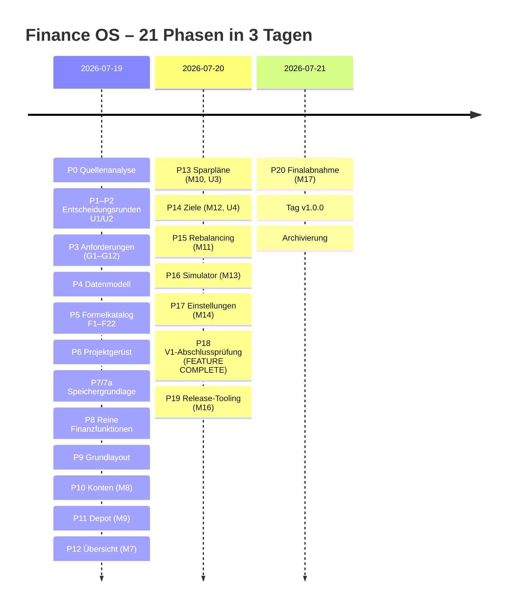

# Finance OS – Development History

**Das vollständige Entwicklungstagebuch**

| | |
|---|---|
| Projekt | Finance OS – lokale persönliche Finanzanwendung |
| Version | 1.0.0 („Feature Complete“, lokal final freigegeben) |
| Entwicklungszeitraum | 2026-07-19 bis 2026-07-21 (Phasen 0–20) |
| Technologie | React 19 + TypeScript 5.8 + Vite 7, Vitest 3 + React Testing Library |
| Endstand | 815/815 Tests grün (37 Testdateien), Build ✓, Lint ✓, Tag `v1.0.0` (lokal) |
| Status | Privates persönliches Projekt – keine Veröffentlichung, kein Push |
| Archiv erstellt | 2026-07-21, im Rahmen der Projekt-Archivierung (project-history/) |

> **Quellenlage dieses Dokuments:** Erstellt aus `progress.md` (Phasen 0–20), den verbindlichen Dokumenten unter `docs/`, README/CHANGELOG/RELEASE_NOTES, der Implementierung selbst und dem Sitzungswissen der Entwicklungs-Sitzungen für M10–M17. Für die Module M1–M9 lagen die ursprünglichen Chat-Diskussionen in der Archivierungs-Sitzung nicht mehr vor; ihre Darstellung stützt sich auf die (sehr detaillierten) progress.md-Einträge und die Dokumentation. Wo eine Information fehlt, steht das ausdrücklich dabei – nichts ist erfunden.

---

## Inhaltsverzeichnis

1. [Executive Summary](#1-executive-summary)
2. [Motivation, Vision und Projektziele](#2-motivation-vision-und-projektziele)
3. [Architektur](#3-architektur)
4. [Datenmodell](#4-datenmodell)
5. [Storage](#5-storage)
6. [Finanzlogik](#6-finanzlogik)
7. [UI und Barrierefreiheit](#7-ui-und-barrierefreiheit)
8. [Tests](#8-tests)
9. [Reviews und Prüfkette](#9-reviews-und-prüfkette)
10. [Chronologische Entwicklung](#10-chronologische-entwicklung)
11. [Die Module im Detail (M1–M17)](#11-die-module-im-detail)
12. [Lessons Learned](#12-lessons-learned)
13. [Qualitätsmaßnahmen](#13-qualitätsmaßnahmen)
14. [Feature Complete und Finalabnahme](#14-feature-complete-und-finalabnahme)
15. [Roadmap](#15-roadmap)
16. [Glossar](#16-glossar)
17. [Abkürzungen](#17-abkürzungen)
18. [Quellen](#18-quellen)
19. [Statistiken](#19-statistiken)

---

## 1. Executive Summary

Finance OS ist eine vollständig lokal laufende persönliche Finanzanwendung, die in drei Tagen (2026-07-19 bis 2026-07-21) in 21 dokumentierten Phasen von der Quellenanalyse bis zur lokal final freigegebenen Version 1.0.0 entwickelt wurde. Sie verwaltet Konten, Depot, Sparpläne, Ziele, Rebalancing-Analysen, Simulationen und Einstellungen des Projektinhabers – ohne Cloud, ohne Backend, ohne Netzwerkzugriffe. Die einzige dauerhafte Datenquelle ist eine JSON-Datei, die der Nutzer selbst öffnet und speichert.

Drei Eigenschaften prägen das Projekt:

1. **Dokumentation vor Code.** Die ersten sechs Phasen erzeugten ausschließlich Dokumente: eine Quellenanalyse der realen Finanznotizen, zwei Entscheidungsrunden mit dem Nutzer (U1/U2), Anforderungen mit 12 globalen Regeln (G1–G12), ein Datenmodell mit Validierungskatalog und ein Formelkatalog (F1–F22) mit vorab nachgerechneten Sollwerten. Der Code wurde anschließend gegen diese Sollwerte gebaut – nicht umgekehrt.
2. **Agenten-Prüfkette je Modul.** Jedes Fachmodul durchlief eine feste Kette: Spezifikation → data-architect (Ratifizierung mit Auflagen) → frontend-developer → finance-analyst + accessibility-review → calculation-tester → reviewer (Freigabe). Findings wurden vor der Freigabe behoben oder als begründete Restpunkte dokumentiert.
3. **Ehrlichkeit als Fachregel.** „Keine Finanzwerte erfinden“, „unbekannt ≠ 0“, „real und geglättet nie vermischen“, „keine Doppelzählung“ sind nicht nur Doku-Sätze, sondern in reinen Funktionen, Validierungsregeln und über 100 Stop-/Negativtests verankert.

Endstand: 14 Fachmodule (M1–M14), Release-Tooling (M16) und Finalabnahme (M17); 815 automatisierte Tests; vier Finalreviews mit Freigabe; annotierter lokaler Git-Tag `v1.0.0`; alles ausschließlich lokal und privat.

## 2. Motivation, Vision und Projektziele

### Motivation

Der Projektinhaber (Werkstudent bei der Deutschen Telekom) verwaltete seine Finanzen in verstreuten Markdown-Notizen (`reference/`): Depotpositionen bei Trade Republic und FNZ (VL), ein Telekom-Aktienprogramm (Shares2you) über Equatex, Tagesgeld bei der Volkswagen Bank, eine zweckgebundene ING-Rücklage. Die Notizen enthielten Widersprüche (z. B. veraltete Sparraten, ein 160-€-Dauerauftrag, dessen dokumentierte Teile nur 150 € ergaben) und Doppelzählungsfallen (die ING-Rücklage und die spätere Equatex-Jahreseinzahlung sind **dieselben** Gelder).

### Vision

Ein einziges lokales Werkzeug, das diese Realität korrekt abbildet: getrennte Kennzahlen für eigene Sparleistung und Gesamtzufluss, saubere Trennung von Tagesgeld und Depot, unveränderliche historische Snapshots, Rebalancing-**Empfehlungen** ohne jede Automatik, Projektionen ohne Prognose-Anspruch – und all das ohne Cloud, ohne Konten, ohne Datenabfluss.

### Projektziele (aus CLAUDE.md und requirements.md §1)

- JSON-Datei als einzige dauerhafte Datenquelle; nach Cache-Löschung vollständig wiederherstellbar.
- Finanzlogik strikt von React getrennt; jede Berechnung unabhängig testbar.
- Keine Bankzugänge, keine Zugangsdaten, keine externen Finanz-APIs.
- Deutsch, ruhig, barrierearm; Bestätigung vor kritischen Aktionen; Farbe nie als einziges Signal.
- V1-Umfang: exakt die Module M1–M14 (siehe Kapitel 11); alles Weitere ausdrückliches Nicht-Ziel.

## 3. Architektur

### Schichtenmodell

### Die tragenden Entscheidungen (das WARUM)

| Entscheidung | Begründung | Alternative (verworfen) |
|---|---|---|
| JSON-Datei statt Browser-Speicher | Nutzerhoheit, Portabilität, Cache-Löschung überlebbar; localStorage ist unter Nutzerkontrolle nicht verlässlich | localStorage/IndexedDB als Primärspeicher – verworfen, weil Datenverlust bei Cache-Löschung droht |
| Keine Router-Bibliothek (useState-Navigation, `pages.ts`) | 9 feste Seiten, keine Deep-Links nötig; jede Dependency ist Wartungslast | react-router – verworfen als unnötige Komplexität (Phase 9) |
| Keine Chart-/UI-Bibliothek | Volle Kontrolle, keine Lizenz-/Update-Risiken; das einzige Diagramm (M13) ist handgerolltes Inline-SVG und nur „Zusatz“ – die Tabelle bleibt Primärquelle | Recharts/Chart.js – verworfen (Phase 6, bewusst) |
| Reine Finanzschicht ohne React | Testbarkeit, Nachrechenbarkeit, keine versteckten Effekte | Berechnungen in Komponenten/Hooks – durch CLAUDE.md verboten |
| Zeit als injizierter Stichtag (`todayIso` aus dem Provider) | Deterministische Tests, kein verstecktes `new Date()` in Fachcode | Systemuhr je Seite – als Altlast nur noch in zwei M8/M9-Formular-Defaults (V1.x-17) |
| Ein Reducer, ein Zustand, `applyDataChange` | Jede Datenänderung läuft durch denselben Pfad (Dirty-Status, DM21-Schutz, Validierung) | verteilte setState-Logik – verworfen |

### Modul-Abhängigkeiten (fachlich)

## 4. Datenmodell

Verbindliche Quelle: `docs/data-model.md`. Kernpunkte und ihre Begründungen:

- **`schemaVersion: 1` – nie erhöht.** Alle Erweiterungen der Module M8–M14 waren additiv (neue optionale Felder/Enum-Werte mit Default) und sind im §6-Protokoll einzeln dokumentiert. Migrationscode existiert nicht, weil er nie nötig wurde; die Migrations**strategie** (Kette reiner `migrateVtoV+1`-Funktionen, Sicherung vorher, atomare Übernahme) ist für die Zukunft definiert. Ältere Versionen als 1 existieren nicht – `schemaVersion < 1` wird hart und sicher abgelehnt (Präzisierung der Finalprüfung).
- **Keine berechneten Werte speichern.** Fortschritte, Status, Summen und Anteile werden immer abgeleitet (`deriveGoalStatus`, `effectiveEmergencyFundTarget`, …). Das verhindert Drift zwischen gespeichertem und wahrem Wert – eine der frühesten und konsequentesten Regeln des Projekts.
- **Historie statt Überschreiben (G3/G4).** Salden und Positionswerte sind datierte Einträge; Snapshots werden nach dem Speichern `locked` und sind unveränderlich – Korrekturen nur als neuer Snapshot. `lockedDates.ts` erzwingt das für alle Schreiboperationen (Regel 15/DM21).
- **Zuflussarten-Taxonomie (`flowType`).** `own_fixed`, `own_variable`, `employer`, `provider`, `reserve_transfer`, `liquidity_transfer` – die strukturelle Antwort auf die Doppelzählungsfallen: Umbuchungen zählen nie (G7), Arbeitgeber-/Anbieterleistungen sind nie „eigene Sparleistung“ (G8).
- **Unbekannte Zusatzfelder überleben jede Rundreise** (`WithUnknownFields`-Muster) – Vorwärtskompatibilität ohne Migrationszwang.
- **K2-Byte-Identität:** Datenfunktionen materialisieren optionale Schlüssel nie als Default; ein No-Op-Patch erzeugt ein Byte-identisches Serialisat. Warum: Der Dirty-Status entsteht nur bei echter Änderung, und Dateien bleiben minimal. (Altlast: M8/M9-Formular-Edits materialisieren Defaults – V1.x-18.)
- **Fehler-/Warnungskatalog:** 21 `E_*`-Codes + 5 `W_*`-Codes, verbindlich katalogisiert in data-model §5 (in der V1-Abschlussprüfung dorthin konsolidiert, nachdem der ungenutzte `ERROR_CODES`-Export entfernt wurde).

## 5. Storage

Verbindliche Quelle: `docs/storage-concept.md`. Der Speicherweg wurde in Phase 7 als **erstes** Codepaket gebaut – bevor irgendein Fachmodul existierte – weil Datenintegrität die Grundlage für alles Weitere ist.

Wesentliche Eigenschaften und ihre Geschichte:

- **File System Access API mit ehrlichem Fallback:** Chrome/Edge speichern direkt in dieselbe Datei; Firefox/Safari erhalten den Download-Weg – mit ausdrücklichem Hinweis, dass die Originaldatei **nicht** überschrieben wurde. Phase 7a fand hier drei echte Fehler (falscher Feature-Check `showOpenFilePicker` statt `showSaveFilePicker`; fehlende „Speichern unter“-Aktion; missverständliche Fallback-UI) – alle behoben und mit `saveHandle.test.tsx` gepinnt.
- **Import ist der einzige Weg, Fremddaten zu übernehmen:** Validierung → Vorschau (inkl. „geladener Bestand ist neuer“-Warnung) → angebotene Sicherung → ausdrückliche Bestätigung. Fehlschlag/Abbruch lässt **alle** fachlichen Daten referenzidentisch unverändert; nur `importHistory` protokolliert (`rejected`/`cancelled`) – bewusst ohne Dirty-Status (Regel 17/DM5).
- **Auto-Backup (M14/M5):** Nach jedem erfolgreichen direkten Speichern lädt die App eine datierte Sicherungskopie herunter – **Byte-identisch zum geschriebenen Serialisat** (nie ein neu serialisierter State, Auflage A2). Default `everySave`; ein fehlender Modus wirkt als Default, ohne materialisiert zu werden (data-architect-Korrektur Nr. 3). Der Tagesmerker für den `dailyFirstSave`-Modus ist der **einzige** erlaubte localStorage-Schlüssel (`financeos.lastAutoBackupDay`, Allowlist in `localStoragePolicy.ts`).

## 6. Finanzlogik

Verbindliche Quellen: `docs/calculation-rules.md` (Formelkatalog F1–F22 + Modul-Bausteine) und `docs/investment-source-map.md` (die bestätigte Faktenbasis).

Die Finanzlogik entstand in einer ungewöhnlichen Reihenfolge: **Erst der Katalog, dann der Code.** In Phase 5 wurden alle 22 Formeln mit Eingaben, Randfällen und exakten numerischen Sollwerten auf Basis des bestätigten Start-Snapshots (2026-07-17) dokumentiert und vom finance-analyst unabhängig nachgerechnet (u. a. Σ Kaufbedarf = Σ Verkaufsbedarf = 1.573,80 € im Job-Profil). Phase 8 implementierte dann gegen diese Sollwerte.

Die fachlichen Grundpfeiler:

- **Gesamtvermögen = Tagesgeld + Depot (F1); Tagesgeld ist nie im Depot-Nenner.** Die Depotgewichtung (F5) teilt ausschließlich durch den Depotwert.
- **Eigene Sparleistung (F8) vs. Gesamtzufluss (F9) – strikt getrennt (G8).** Real und geglättet sind zwei Sichten derselben Pläne, die nie vermischt werden (G9); geglättete Werte (z. B. Telekom 125 €/Monat) existieren **nur** als Rechenergebnis, nie als gespeicherter Wert (DM9).
- **Die Telekom-/Shares2you-Mechanik** ist der komplexeste Einzelfall: 75 €/Monat fließen auf die ING-Rücklage (Umbuchung – zählt nie), einmal jährlich (Juli) werden 1.000 € eigen + 500 € Arbeitgeiterbonus bei Equatex eingezahlt. Testfall T1 pinnt: Ein simuliertes Jahr ergibt 1.000 € eigene Telekom-Sparleistung – nicht 1.900 €.
- **Nutzerentscheidungen U3/U4** klärten die letzte Grauzone der Sparleistung: Der primäre 1.000-€-Zielfortschritt ist die eigene **reale** Monatsrate (U3); `own_variable`-Pläne zählen genau dann, wenn sie einen gültigen positiven Festbetrag tragen (U4) – ungültige Beträge zählen defensiv 0, ohne zu werfen.
- **Rebalancing (M11) kennt nur drei Stufen** (`actionLevel`: unter 5 Pp nur Anzeige, ab 5 Pp Empfehlung, ab 10 Pp zusätzlich Verkaufsoption als letzte Möglichkeit) und formuliert ausschließlich im Konjunktiv. Eine vierte „Beobachten“-Schwelle wurde abgelehnt, weil sie quellenlos gewesen wäre.
- **Projektion (M13) ist Arithmetik, keine Prognose:** geometrischer Monatsfaktor (1+r)^(1/12), nur das Depot wird verzinst, Beiträge am Monatsende; `startMonth` ist der Folgemonat des Stichtags (Korrektur 2.1 – ein data-architect-Fund gegen einen Off-by-one in der Spezifikation).

## 7. UI und Barrierefreiheit

Verbindliche Quelle: `docs/design-system.md`. Die UI-Muster wurden nicht vorab entworfen, sondern **aus den Modul-Reviews destilliert** und dann rückwirkend verbindlich:

- Feldnahe Fehler mit `aria-invalid`/`aria-describedby` und Fokus auf das erste Fehlerfeld (B3-Muster).
- Nach Aktionen, die Elemente entfernen, wandert der Fokus auf einen bestehen bleibenden Anker (B1/B2-Muster – geboren aus einem M11-Befund, bei dem der Fokus auf `document.body` fiel).
- `role="status"`-Feedback am Auslöser; Bestätigungsdialoge nennen immer die konkreten Werte (G12).
- Status nie nur über Farbe (Text + Symbol, z. B. „● Ungespeicherte Änderungen“).
- Tabellen-Scrollcontainer sind fokussierbare, **eigens benannte** Regionen – die Lektion aus einem M10-Fehler, bei dem ein doppelter Accessibility-Name acht Tests brach.
- Diagramme sind `aria-hidden`-Zusätze; die Tabelle ist die Primärquelle („Alle Werte stehen in der Tabelle“).

## 8. Tests

Verbindliche Quelle: `docs/testing-strategy.md` (in der V1-Abschlussprüfung mit dem Ist-Stand befüllt, nachdem die Datei lange leer mitlief – selbst eine Lesson Learned).

| Prinzip | Umsetzung |
|---|---|
| Reine Schicht zuerst | Jede Formel gegen die vorab dokumentierten Seed-Sollwerte gepinnt; Mutationsfreiheit per deepFreeze + Snapshot-Vergleich |
| K2-Pins | No-Op-Patches müssen Byte-identisch serialisieren; unbekannte Felder überleben Rundreisen |
| Zeit injiziert | Seitentests mit festem Stichtag (`FIXED_NOW`), nie Systemuhr |
| Storage über Modul-Mocks | `vi.mock` von fileAccess/featureDetection; Auto-Backup-Tests pinnen Byte-Identität |
| Verhalten statt Implementation | getByRole, sichtbare Texte, Bestätigungen, Fokus – keine internen Zustände |
| Stop-Tests | G10/G3/G12/NaN-Verbote haben eigene Negativtests, die absichtlich das gefährliche Verhalten provozieren |

Trajektorie der Testzahl (je Phasenabschluss): 2 → 63 → 68 → 138 → 147 → 192 → 287 → 342 → 440 → 544 → 615 → 717 → **815** (37 Dateien). Kein Test wurde je entfernt, um einen Fehler zu verdecken; der einzige nachträglich veränderte Bestandstest (Escape-Verhalten M14) wurde als **gewollte Musterangleichung** umgeschrieben und so dokumentiert.

## 9. Reviews und Prüfkette

Warum dieser Aufwand? Die Kette hat **real** Fehler gefangen, die sonst geschifft worden wären – Beispiele: der actionLevel-Fehler (Verkaufsoption bei Untergewichtung, Phase 8, inklusive eines Tests, der das falsche Verhalten festschrieb), der startMonth-Off-by-one (M13-Spezifikation), der falsche Backup-Default in der M14-Spezifikation des Orchestrators selbst (Korrektur Nr. 3), das Kennzahlen-Trio, das drei Dokumente versprachen und niemand gebaut hatte (V1-Abschlussprüfung), und die Backup-Zusicherung „keine echten Finanzdaten“, die faktisch falsch war (M16-data-architect H1).

Organisatorische Besonderheit: Die Projekt-Agentendefinitionen unter `.claude/agents/` waren in den Sitzungen nicht als Subagenten registriert – jede Prüfung lief als general-purpose-Agent mit hineinkopierter Rollendefinition. Das funktionierte, ist aber dokumentierter Workaround.

## 10. Chronologische Entwicklung

| Phase | Datum | Inhalt | Tests danach |
|---|---|---|---|
| 0 | 07-19 | Quellenanalyse, Source Map, Konflikte K1–K14, 24 offene Entscheidungen | – |
| 1–2 | 07-19 | Entscheidungsrunden U1/U2 – alle Entscheidungen geschlossen oder bewusst zurückgestellt | – |
| 3 | 07-19 | requirements.md: M1–M14, G1–G12, Nicht-Ziele | – |
| 4 | 07-19 | data-model.md + storage-concept.md + Beispieldatei (data-architect + finance-analyst) | – |
| 5 | 07-19 | Formelkatalog F1–F22 mit nachgerechneten Sollwerten | – |
| 6 | 07-19 | Projektgerüst (React/TS/Vite/Vitest/ESLint/Prettier; bewusst keine weiteren Libraries) | 2 |
| 7/7a | 07-19 | Speichergrundlage M1–M6 + Handle-Nachprüfung (3 echte Fehler gefunden) | 63 / 68 |
| 8 | 07-19 | Reine Finanzfunktionen F1–F22 (actionLevel-Fehler gefunden und behoben) | 138 |
| 9 | 07-19 | Grundlayout, 9 Seiten, ohne Router | 147 |
| 10 | 07-19 | M8 Konten (Kein-Löschen-Linie, DM21 verdrahtet) | 192 |
| 11 | 07-19 | M9 Depot (Snapshot-Vollerfassung, locked-Registry) | 287 |
| 12 | 07-19 | M7 Übersicht (G11-„unbekannt“-Regel, todayIso-Injektion) | 342 |
| 13 | 07-20 | M10 Sparpläne + U3 | 440 |
| 14 | 07-20 | M12 Ziele + U4 | 544 |
| 15 | 07-20 | M11 Rebalancing (Konjunktiv-Regel, plannedChanges) | 615 |
| 16 | 07-20 | M13 Simulator (startMonth-Korrektur) | 717 |
| 17 | 07-20 | M14 Einstellungen (Auto-Backup A2–A8) – letztes V1-Modul | 815 |
| 18 | 07-20 | V1-Abschlussprüfung → FEATURE COMPLETE, Version 1.0.0 | 815 |
| 19 | 07-20 | M16 Release-Tooling (Skripte, CHANGELOG, LICENSE) | 815 |
| 20 | 07-21 | M17 Finalabnahme → lokaler Tag v1.0.0 | 815 |

Auffällig: **M12 wurde vor M11 gebaut** (Phase 14 vor 15), obwohl die Modulnummern anderes nahelegen – die Zielverwaltung brauchte nur M10-Bausteine, während Rebalancing von stabilen Ziel- und Sparplan-Schichten profitierte.

## 11. Die Module im Detail

> Raster je Modul: Ausgangslage → Anforderungen/Nutzerziele → Diskussionen/Entscheidungen → Implementierung → Probleme & Lösungen → Reviews → Lessons Learned. Für M1–M9 basiert die Darstellung auf progress.md und Doku (Original-Diskussionen nicht mehr in der Sitzung verfügbar); für M10–M17 zusätzlich auf dem Sitzungswissen.

### M1–M6 – Speichergrundlage (Phasen 7/7a)

- **Ausgangslage:** Leeres Projektgerüst; Datenmodell und Storage-Konzept als Dokumente fertig.
- **Anforderungen:** Öffnen/Speichern/Export/Import/Sicherungen/Ungespeichert-Anzeige – als Fundament VOR jedem Fachmodul.
- **Entscheidungen:** Vierstufige Ladevalidierung (A Format, B Referenzen, C Fachregeln, D Schutzregeln) mit deutschen, pfadgenauen Meldungen; abgelehnte Importe hinterlassen nur einen `importHistory`-Eintrag ohne Dirty-Status; `isSaving`-Sperre gegen Speicher-Wettläufe.
- **Probleme & Lösungen:** Reviewer verweigerte zunächst Teile (unbehandelte Fehlerpfade, fehlende Importvorschau-Warnung) → behoben mit Regressionstests. Phase 7a fand per gezielter Nachprüfung drei echte Fehler im Handle-Verhalten (falscher Feature-Check, fehlendes „Speichern unter“, irreführende Fallback-UI).
- **Lesson Learned:** Eine dedizierte „Nachprüfungs-Phase“ gegen explizit formulierte Verhaltenserwartungen findet Fehler, die die normale Testsuite strukturell nicht sieht (jsdom kennt keine echten Browserdialoge).

### M7 – Übersicht/Dashboard (Phase 12)

- **Ausgangslage:** Konten und Depot existierten; die Übersicht wurde bewusst NACH ihren Datenquellen gebaut.
- **Entscheidungen:** G11-Präzisierung – hat keine Quelle einer Summen-Kennzahl einen erfassten Wert, zeigt die Kachel „unbekannt“, nie eine leere 0; Teilsummen tragen „enthält unbekannte Werte“. Einführung des injizierten `todayIso` (finance-analyst-Befund gegen die Systemuhr im Fachcode).
- **Reviews:** Freigabe mit Auflage M1 (die „World gesamt“-Zeile musste derselben G11-Regel folgen) – umgesetzt.
- **Lesson Learned:** „Unbekannt ≠ 0“ ist als UI-Regel genauso wichtig wie als Rechenregel.

### M8 – Konten (Phase 10)

- **Entscheidungen:** **Kein Löschen** – Konten werden deaktiviert (stabile Referenzen); Typ nachträglich unveränderbar; Salden-Erfassung als neuer datierter Eintrag; DM21 (gesperrte Snapshot-Daten) hier erstmals verdrahtet; additive Enum-Erweiterung (bargeld/sonstiges) im §6-Protokoll.
- **Reviews:** Freigabe unter Auflage (behoben + Regressionstests). Dokumentierte Altpunkte (Warnungs-Aufräumen, Trim, collectAllIds-Duplikat) leben als V1.x-18 weiter.
- **Lesson Learned:** Die „Kein-Löschen-Linie“ (Deaktivieren statt Löschen) wurde zum Projektmuster für alles mit Referenzen – nur referenzlose Simulationen (M13) dürfen hart gelöscht werden.

### M9 – Depot und Tagesgeld (Phase 11)

- **Entscheidungen:** Snapshot-Vollerfassung als Ganz-oder-gar-nichts mit 9 Fehlerstufen; `locked` ab Speicherung; Rückdatierung nur mit Bestätigung; fehlende Werte werden **nie** als 0 gespeichert; keine Stückzahlen/WKN (nicht im bestätigten Quellenmaterial – „nichts erfinden“).
- **Probleme:** W4-Warn-Semantik (nach einem Snapshot neu angelegte Positionen lassen ältere Snapshots „unvollständig“ erscheinen) – als dokumentierte Grenze stehen gelassen (V1.x-10) statt schnell und falsch „repariert“.
- **Reviews:** finance-analyst bestätigte die Kernarithmetik am Seed (u. a. +44,27775 Pp Telekom); Freigabe.
- **Lesson Learned (nachträglich):** Die in requirements versprochene Snapshot-**Verlaufsansicht** wurde nie gebaut und fiel erst in der V1-Abschlussprüfung als unbegründet fehlend auf → heute requirements-Nachtrag + V1.x-7. Soll-Ist-Abgleiche gehören nicht nur ans Modulende, sondern ans Projektende.

### M10 – Sparpläne und Zuflüsse (Phase 13, mit U3)

- **Ausgangslage:** Die Zuflussarten-Taxonomie existierte im Datenmodell, aber ohne Verwaltungs-UI und ohne verbindliche Bezugsgröße für das 1.000-€-Ziel.
- **Nutzerentscheidung U3:** Primärer Zielfortschritt = eigene **reale** Monatsrate (Seed 118,50/1.000 = 11,85 %); geglättet (201,83) nur als gekennzeichneter Analysewert; Gesamtzufluss getrennt.
- **Entscheidungen:** Intervalle +quarterly/halfyearly/once (mit Glättungsfaktoren atomar gekoppelt); `isPaused` als Momentzustand ohne Historie (dokumentiert); die geforderte „ca. 260–265 €“-Schätzsumme wurde **bewusst nicht** angezeigt – ohne erfasste Ist-Buchungen wäre sie ein erfundener Wert (G11); In-place-Bearbeitung statt Planversionierung (Vergangenheit kommt ausschließlich aus `transactions`).
- **Probleme & Lösungen:** Ein doppelter Accessibility-Name (Tabellen-Region = Sektionsname) brach 8 Tests → eigene Namen für Scroll-Regionen wurden Projektmuster.
- **Lesson Learned:** Eine Anforderung nicht umzusetzen und das laut zu begründen (Reviewer-Ausweis) ist besser, als eine Scheinzahl zu bauen.

### M12 – Finanzielle Ziele (Phase 14, mit U4)

- **Nutzerentscheidung U4:** `own_variable` mit gültigem positivem Festbetrag zählt vollständig; null/0/negativ/nicht endlich zählt nicht (defensiver Guard statt Exception) – die letzte Sparleistungs-Grauzone geschlossen, inklusive 12 Pflichttests.
- **Entscheidungen:** Neue Zielarten (Kontostand, Positionswert, manuell) additiv; Statusmodell mit gespeichertem Nutzerwillen (`reached` = manuell abgeschlossen) vs. abgeleitetem „rechnerisch erreicht“, das bei sinkendem Ist zurückfällt; Ziele werden **nie** gelöscht (archived); bewusst keine Ist-Summen-Kachel (überlappende Bezugswerte – Depot ⊂ Gesamtvermögen – machten jede Addition irreführend).
- **Probleme:** Signaturänderung von `assignedOwnPlans` (Aktiv-Filter) zog ~10 Test-Callsites nach – Preis der reinen Schicht, bewusst bezahlt.
- **Lesson Learned:** „Gespeichert wird Nutzerwille, abgeleitet wird Wahrheit“ trägt als Statusprinzip durch das ganze Modul.

### M11 – Rebalancing (Phase 15)

- **Anforderungen:** Nur Analyse und Empfehlungen; Formulierung ausschließlich „Wenn du … möchtest, könntest du …“; keine neuen Schwellen.
- **Entscheidungen:** Statuslabels auf die DREI bestehenden actionLevel-Stufen gemappt (eine vierte „Beobachten“-Stufe abgelehnt: quellenlos); F17-Budget präzise definiert (aktive, flexible, eigene, monatliche Positions-Pläne – Seed 60,00 €); `plannedChanges` mit `createdAt` = injiziertem Datum, Status planned/discarded, **kein** Zurücksetzen von verworfen (G5-Schutz); Voll-Simulation erzeugt nie einen `simulations[]`-Eintrag (Abgrenzung zu M13, Auflage A7).
- **Reviews:** B1/B2-Fokusbefunde der A11y-Prüfung wurden zu dauerhaften Projektmustern.
- **Lesson Learned:** Sprachregeln (Konjunktiv) sind testbar – und wurden getestet.

### M13 – Simulator & Projektionen (Phase 16)

- **Entscheidungen:** `simulations[]` strikt getrennt von Ist-Daten; Rendite 0–15 % (keine negativen Annahmen – Auftragsbereich), Warnung > 8 %; keine Inflation, kein Rebalancing-Schalter (wäre Scheinfunktion im Aggregatmodell); hartes Löschen erlaubt (einzige Ausnahme der Kein-Löschen-Linie: referenzlose Szenario-Entwürfe); handgerolltes SVG nur als Zusatz.
- **Probleme & Lösungen:** Der data-architect fand einen Off-by-one in der **Spezifikation des Orchestrators** (startMonth musste der Folgemonat des Stichtags sein) – gepinnt mit dem 6-Monats-Sollwert 777,59/3.122,47/3.900,06, weil der 12-Monats-Pin allein den Fehler maskiert hätte.
- **Lesson Learned:** Pins müssen so gewählt sein, dass sie den plausibelsten Fehler NICHT überleben.

### M14 – Einstellungen & Datenverwaltung (Phase 17)

- **Entscheidungen:** Alle Settings-Felder existierten bereits – M14 fügte **kein** Feld hinzu; Notgroschen ausschließlich über das bestehende `effectiveEmergencyFundTarget` (keine zweite Formel); Zielprofil nur **Auswahl** (Bearbeitung = abnahme-relevanter Konflikt-Ausweis, V1.x-2); Auto-Backup-Regeln A2–A8 (Byte-Identität, Fehler nie fatal, kein Backup im Fallback); percentDecimals-Ganzzahl als einzige Ladeverschärfung.
- **Probleme & Lösungen:** Die eigene Spezifikation schlug „kein Auto-Backup bei fehlendem Modus“ vor – der data-architect korrigierte auf den dokumentierten Default `everySave` (Korrektur Nr. 3). Ein globaler Escape-Handler wurde nach A11y-Review wieder **entfernt** (B3: das immer offene Formular ist kein Dialog; Escape kann aus Selects/IME bubbeln) – der zugehörige Test wurde als gewollte Musterangleichung umgeschrieben. Ein Testinfrastruktur-Fehler (datei-weiter featureDetection-Mock brach die Fallback-Tests) wurde mit einem pro Test steuerbaren Mock gelöst.
- **Lesson Learned:** Auch die Spezifikation des Orchestrators braucht die Prüfkette.

### M15 – V1-Abschlussprüfung (Phase 18)

- **Inhalt:** Vollständiger Soll-Ist-Abgleich aller sechs Dokumente, Architekturprüfung (0 Zyklen; tote Exporte entfernt), Codequalität (keine TODO/console/auskommentierter Code), README/Version 1.0.0/Lizenz, konsolidierter V1.x-Abschnitt, data-architect + reviewer.
- **Funde:** Drei unbegründet fehlende Zusagen (Strg+S; Snapshot-Verlaufsansicht; **Kennzahlen-Trio** Finanzvermögen/Anlagevermögen/freie Liquidität – von drei Dokumenten versprochen, nie gebaut, inklusive eines UI-Hilfetexts, der eine nicht existierende Kennzahl versprach); T6 ohne Test (Fixkosten kein V1-Modul); DM12-Migrationszusage vs. harte Ablehnung; der entfernte `ERROR_CODES`-Katalog riss eine Doku-Referenz (H1) → Katalog in data-model §5 nachgetragen.
- **Ergebnis:** FEATURE COMPLETE, Freigabe von data-architect und reviewer.

### M16 – Release Engineering (Phase 19)

- **Inhalt:** 9 Batch-Einstiegspunkte + 3 PowerShell-Helfer (Start/Stop mit PID-Datei und Name+Startzeit-Abgleich; check-all; clean mit Schutzregeln; Backup mit Positivliste und ZIP-Nachvalidierung; Release mit Dirty-Schutz, Staging-Swap und Manifest aus realen Laufwerten), CHANGELOG, LICENSE (bewusst „alle Rechte vorbehalten“ – keine erfundene Open-Source-Lizenz), README-Workflow, .gitignore-Härtung (`user-data/*` mit Beispieldatei-Ausnahme).
- **Zentrale Erkenntnis (data-architect H1):** Das „Quellcode-Backup“ enthält zwangsläufig die realen Finanzwerte, weil Doku/Tests/Beispieldatei auf ihnen basieren – die Zusicherung wurde ehrlich korrigiert: Backups sind **selbst vertraulich**.
- **Skripttests real ausgeführt** (PID-Lebenszyklus, Fehlerweitergabe, Dirty-Abbruch, ZIP-Validierung); dabei ein echter Regex-Bug gefunden (`\.git` matchte `.gitignore`).

### M17 – Lokale Finalabnahme (Phase 20)

- **Inhalt:** Secrets-Scan über Stand + gesamte Historie + PDF (zlib-Streamextraktion): keine Geheimnisse (Fall B – reference/ bleibt getrackt als Nutzerentscheidung); RELEASE_NOTES, USER_GUIDE (28 Punkte), V1_X_ROADMAP; M17-Manifest-Schema (gitTag/pushed real gemessen); Smoke-Tests ehrlich dokumentiert (Headless-Edge rendert Dev und Build; Firefox headless nicht ausführbar; keine manuelle Bedienprüfung behauptet); vier Finalreviews (alle JA); Commit → annotierter lokaler Tag `v1.0.0` → finale Artefakte.
- **Bemerkenswert:** Ein während der Sitzung neu entstandener privater Ordner auf Repo-Ebene hätte den Release fälschlich „dirty“ gemacht → der Dirty-Check wurde auf das Projektverzeichnis gescopet; der minutenalte, nie gepushte Tag wurde dafür einmalig transparent neu gesetzt.
- **Ergebnis:** „Finance OS v1.0.0 ist lokal final freigegeben. Das Projekt wurde nicht veröffentlicht und bleibt ausschließlich privat.“

## 12. Lessons Learned

1. **Sollwerte vor Code.** Der vorab nachgerechnete Formelkatalog machte Implementierungsfehler zu Testfehlern statt zu stillen Datenfehlern.
2. **Die Prüfkette prüft auch den Prüfer.** Zwei der wirksamsten Funde betrafen die eigene Spezifikation (startMonth, Backup-Default).
3. **Ehrliche Nicht-Umsetzung schlägt Scheinfunktion.** 260–265-€-Schätzsumme, Inflations-Schalter, „Beobachten“-Schwelle – dokumentiert abgelehnt statt quellenlos gebaut.
4. **Pins gegen den plausibelsten Fehler wählen** (6-Monats- zusätzlich zum 12-Monats-Pin).
5. **Byte-Identität ist ein hervorragendes Testorakel** für „nichts hat sich geändert“ – von K2 bis zum Auto-Backup (A2).
6. **A11y-Befunde werden Muster,** wenn man sie generalisiert (B1/B2/B3, eigene Regionsnamen, Pflichtfeld-Legende) – und Muster brauchen einen Ort (design-system.md).
7. **Soll-Ist-Abgleich gehört ans Projektende.** Drei „vergessene“ Zusagen überlebten alle Modul-Reviews, weil jedes Review nur sein Modul sah.
8. **Vertraulichkeit ist eine Eigenschaft der Inhalte, nicht der Dateinamen.** Ein „Quellcode“-Backup mit realen Seed-Werten ist vertraulich – die Zusicherung musste der Realität folgen, nicht umgekehrt.
9. **Flaky Tests härtet man, statt sie zu leugnen** (appLayout-Timeout unter Volllast: dokumentierter `{ timeout: 30000 }` statt Testverzicht oder Wiederholungs-Roulette).
10. **Dokumentierte Grauzonen sind Arbeitsvorrat.** Die U3/U4-Entscheidungen entstanden aus sauber dokumentierten offenen Fragen früherer Phasen.

## 13. Qualitätsmaßnahmen

- G1–G12 als übergeordnete, in jedem Review geprüfte Regeln (in der V1-Abschlussprüfung je einzeln mit Datei:Zeile-Beleg bestätigt).
- Prüfkette je Modul (Kapitel 9) mit dokumentierten Findings und Auflagen in progress.md.
- Stop-Bedingungen je Auftrag (z. B. „Import darf nie Daten überschreiben“, „keine NaN sichtbar“) mit eigenen Negativtests.
- Testfälle dreifach katalogisiert: T1–T9 (fachlich), DM1–DM23 (Laden/Speichern), ST1–ST6 (Storage).
- Keine Funktion gilt als fertig ohne grüne Tests; Build (inkl. `tsc --noEmit`) und Lint verpflichtend je Phase.
- Release-Manifest ausschließlich aus real gemessenen Werten (Testzahlen geparst, Tag/pushed per git ermittelt).

## 14. Feature Complete und Finalabnahme

- **2026-07-20, Phase 18:** FEATURE COMPLETE – alle 14 V1-Module, 815/815, Version 1.0.0.
- **2026-07-21, Phase 20:** Lokale Finalabnahme mit vier Reviews (data-architect, Security/Privacy, Accessibility, reviewer – alle JA), Commits `79f1090` + `d624e2d`, annotierter lokaler Tag `v1.0.0`, finaler Release `releases/finance-os-v1.0.0/` (+ ZIP) mit Manifest `gitTag: v1.0.0, pushed: false, published: false, dirty: false`.
- Nichts wurde gepusht oder veröffentlicht; das private GitHub-Remote blieb unverändert.

## 15. Roadmap

Verbindlich: `docs/V1_X_ROADMAP.md` (Priorisierung) und progress.md „V1.x – Offene Punkte“ (26 Punkte). Kurzfassung: **V1.1** = Bedienung/Darstellung (Strg+S, Kennzahlen-Trio, Snapshot-Verlaufsansicht, Format-Dedup, A11y-Nachrüstungen, Profilbearbeitung); **später** = Transaktionshistorie, Performance, Dividenden, Steuern, Brokerimporte, erweiterte Projektionen sowie die CLAUDE.md-Langfristmodule (Monatsfinanzen, Fixkosten, Journal, Monatsabschluss, Wissensbereich). Nichts ist zugesagt oder terminiert.

## 16. Glossar

| Begriff | Bedeutung |
|---|---|
| Eigene Sparleistung | Zuflüsse aus eigenem Geld (own_fixed/own_variable); Kennzahl F8 |
| Gesamtzufluss | Alle Vermögenszuflüsse inkl. Arbeitgeber/Anbieter; Kennzahl F9 |
| Real vs. geglättet | Tatsächliche Monatszahlung vs. rechnerischer Monatsdurchschnitt (z. B. Telekom 125 €); nie vermischt (G9) |
| Snapshot | Datierter, nach Speicherung gesperrter Vollstand aller aktiven Positionen + Tagesgeldkonten |
| Seed / Beispieldatei | `user-data/finance-data.example.json` – Startvorlage mit den bestätigten realen Werten vom 2026-07-17 |
| Zielprofil | Soll-Allokation (Student A/B, Job, Eigene); Job-Profil normativ 70/15/5/10 |
| actionLevel | Dreistufige Abweichungsbewertung: <5 Pp Anzeige, ≥5 Empfehlung, ≥10 zusätzlich Verkaufsoption |
| plannedChange | Gespeicherte Rebalancing-Planung, „geplant, nicht ausgeführt“ bzw. „verworfen“ |
| Dirty-Status | Angezeigter Unterschied zwischen Arbeitsspeicher und Datei; entsteht nur bei echter Änderung |
| K2-Byte-Identität | Regel: No-Op-Patches erzeugen ein Byte-identisches Serialisat; Defaults werden nie materialisiert |
| Kein-Löschen-Linie | Referenzierte Objekte werden deaktiviert/archiviert, nie gelöscht (Ausnahme: referenzlose Simulationen) |
| Prüfkette | Agenten-Review-Sequenz je Modul (Kapitel 9) |
| Stop-Test | Negativtest, der ein verbotenes Verhalten aktiv zu provozieren versucht |
| Grauzone | Dokumentierte offene fachliche Frage, die eine Nutzerentscheidung braucht (→ U3/U4) |
| Konflikt-Ausweis | Dokumentierte, begründete Abweichung der Implementierung von einer Anforderung |

## 17. Abkürzungen

| Kürzel | Bedeutung |
|---|---|
| G1–G12 | Globale verbindliche Anforderungen (requirements §3) |
| F1–F22 | Formelkatalog (calculation-rules §12) |
| T1–T9 / DM1–DM23 / ST1–ST6 | Testfall-Kataloge fachlich / Datenmodell / Storage |
| U1–U4 | Verbindliche Nutzerentscheidungen |
| K1–K16 | Quellen-Konflikte der Source Map |
| A2–A8 | data-architect-Auflagen des M14-Auto-Backups |
| B1–B9 | Accessibility-Befundmuster (Fokus, aria, …) |
| DM21 | Schutzregel „gesperrte Snapshot-Daten unveränderlich“ |
| M-x/H-x/N-x/K-x | Review-Findings mittel/hoch/niedrig/klein |
| Pp | Prozentpunkte |
| FSA | File System Access API |
| VL | Vermögenswirksame Leistungen |
| TR | Trade Republic |
| RTL | React Testing Library |

## 18. Quellen

- `progress.md` – Phasen 0–20 (Primärchronik; Grundlage dieses Dokuments)
- `docs/requirements.md`, `docs/data-model.md`, `docs/calculation-rules.md`, `docs/storage-concept.md`, `docs/design-system.md`, `docs/testing-strategy.md`, `docs/investment-source-map.md`
- `README.md`, `CHANGELOG.md`, `RELEASE_NOTES.md`, `docs/USER_GUIDE.md`, `docs/V1_X_ROADMAP.md`, `LICENSE`
- Implementierung (`src/`, `tests/`, `scripts/`) und Git-Historie (12 Commits, Tag `v1.0.0`)
- Sitzungswissen der Entwicklungs-Sitzungen für M10–M17 (Diskussionen, Review-Berichte)
- **Nicht mehr verfügbar:** die wörtlichen Chat-Diskussionen der Phasen 0–12 sowie die vollständigen Einzel-Reviewberichte vor M10 – ihre Ergebnisse sind über progress.md gesichert.

## 19. Statistiken

| Kennzahl | Wert |
|---|---|
| Entwicklungszeitraum | 3 Kalendertage, 21 Phasen |
| Quellcode | 55 TS/TSX-Dateien, ~17.075 Zeilen (`src/`) |
| Tests | 37 Testdateien (+2 Helfer), ~12.593 Zeilen, **815 Tests** |
| Dokumentation | 9 verbindliche Dokumente unter `docs/` + README/CHANGELOG/RELEASE_NOTES/progress.md |
| Git | 12 Commits, 1 lokaler Tag (`v1.0.0`), master 4 Commits vor origin (nie gepusht) |
| Module | 14 Fach-Module + Grundlayout + Release-Tooling + 2 Abnahmen |
| Nutzerentscheidungen | U1–U4 (plus 6 bewusst zurückgestellte Themen) |
| Review-Freigaben | je Modul 1 (Prüfkette) + 2 (M15) + 2 (M16) + 4 (M17) |
| V1.x-Restpunkte | 26 (konsolidiert, kategorisiert) |
| Bundle-Größe | ~491 kB JS (140 kB gzip), 8 kB CSS |
| Abhängigkeiten | 2 Laufzeit-Pakete (react, react-dom) – sonst nur Dev-Tooling |
