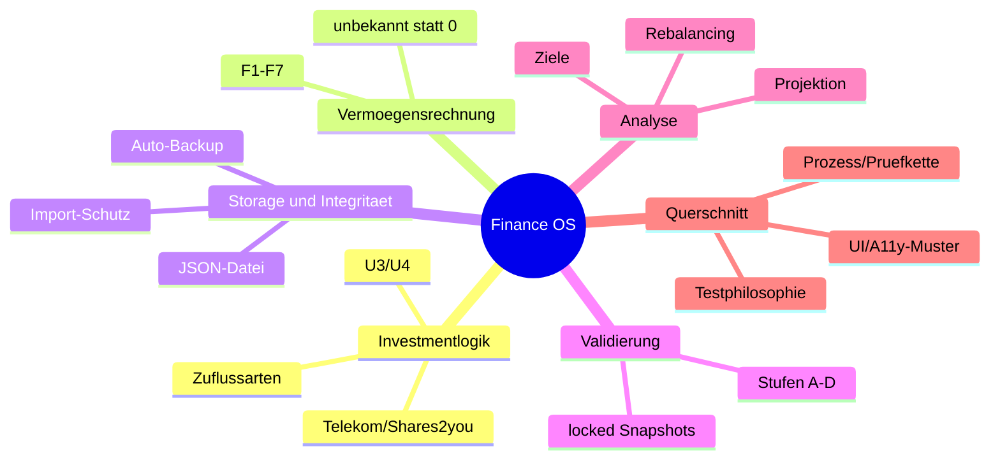

# Finance OS – Knowledge Base (thematisch)

Zweck: Eine zukünftige KI (oder ein Mensch) soll das Projekt **thematisch** – nicht chronologisch – schnell durchdringen. Jedes Thema folgt dem Raster **Entscheidungen → Implementierung → Tests → Reviews → Zusammenfassung**. Chronologie und Modul-Details: [Development History](Finance_OS_Development_History.md); Einzelentscheidungen: [Decision Log](Finance_OS_Decision_Log.md); Schnellzugriff: [Quick Reference](Finance_OS_Quick_Reference.md).

---

## 1. Investmentlogik (Zuflüsse, Sparleistung, Telekom)

**Entscheidungen:** flowType-Taxonomie (own_fixed/own_variable/employer/provider/reserve_transfer/liquidity_transfer); Umbuchungen zählen nie (G7); eigene Sparleistung vs. Gesamtzufluss strikt getrennt (G8); real vs. geglättet nie vermischt (G9, geglättete Werte nie gespeichert – DM9); U3 (primärer 1.000-€-Fortschritt = reale eigene Rate) und U4 (own_variable zählt nur mit gültigem positivem Festbetrag; sonst defensiv 0) – siehe [Decision Log D4/D5/D12/D14](Finance_OS_Decision_Log.md).

**Implementierung:** `src/finance/savings.ts` (F8/F9/F10, SavingsView 'realMonthly'|'smoothed', Glättungsfaktoren quarterly/3 usw.), `src/finance/schedule.ts` (Aktivität, Fälligkeiten, realAmountInMonth), Telekom-Jahresmechanik als `TELEKOM_ANNUAL_EVENT` (1.500 = 1.000 eigen + 500 AG, nur im Juli, nur in der realen Sicht) in `src/finance/projection.ts`.

**Tests:** T1 (Telekom-Jahr = 1.000, nie 1.900), T2 (VL 33,50/40), U4-Pflichttests (12), Seed-Pins 118,50/201,83/250 in `tests/finance/wealthAndSavings.test.ts` und `savingsPlansPage.test.tsx`.

**Reviews:** finance-analyst rechnete alle Sparleistungs-Pins unabhängig nach (mehrere Phasen); die U-Entscheidungen entstanden aus dokumentierten Grauzonen.

**Zusammenfassung:** Wer Zuflusslogik ändert, ändert G7/G8/G9-Territorium – zuerst calculation-rules „Sparplan-Bausteine (M10)“ lesen, dann die T1/U4-Pins respektieren.

## 2. Vermögensrechnung (Kennzahlen)

**Entscheidungen:** Gesamtvermögen = Tagesgeld + Depot (F1); Tagesgeld nie im Depot-Nenner (F5); „World gesamt“ als Aggregat dreier Positionen; unbekannt ≠ 0 (G11): Kennzahlen ohne erfasste Werte zeigen „unbekannt“, Teilsummen tragen „enthält unbekannte Werte“; Division durch 0 → null („nicht berechenbar“). Das Kennzahlen-Trio Finanzvermögen/Anlagevermögen/freie Liquidität ist definiert (data-model §4), aber **nicht** als Anzeige gebaut (V1.x-23; requirements-Nachtrag M7/M8).

**Implementierung:** `src/finance/wealth.ts` (F1–F7, AggregatedAmount mit missingIds, groupTotal/worldTotal, share-Familie).

**Tests:** Seed-Pins (Depot 2.522,47; Tagesgeld 627,59; GV 3.150,06; Telekom 54,27775 %); Reinheits-Snapshots; DM1/DM11.

**Zusammenfassung:** `AggregatedAmount.missingIds` ist der Mechanismus hinter jeder „unbekannt“-Anzeige – nie durch 0-Defaults ersetzen.

## 3. Storage und Datenintegrität

**Entscheidungen:** JSON-Datei als einzige Quelle (D2); Import nur mit Vorschau+Bestätigung, Fehlschlag ändert nichts (G10, Regel 17); Auto-Backup Byte-identisch zum geschriebenen Serialisat (A2), nie fatal (A3), Default everySave (D20); ein einziger localStorage-Schlüssel (D21); isSaving-Sperre gegen Wettläufe.

**Implementierung:** `src/storage/` (fileAccess, featureDetection, serializer, parseFinanceJson, importFlow, backupDownload, autoBackup, emptyFile), `src/state/FinanceDataProvider.tsx` (Reducer, saveDirect/saveAs/EXPORT_MARKED_SAVED-Fallback, beforeunload, runAutoBackupAfterSave), `src/state/localStoragePolicy.ts`.

**Tests:** ST1–ST6, DM2–DM5, saveHandle (5 Handle-Verhaltens-Pins aus Phase 7a), importProtectsData, autoBackup (12, inkl. Backup-Rundreise-Stop-Test), unsavedChanges (Allowlist-Pin).

**Reviews:** Phase-7-Reviewer erzwang Fehlerpfad-Behandlung und Importvorschau-Warnung; Phase 7a fand die drei Handle-Fehler.

**Zusammenfassung:** Der Provider ist die einzige Stelle mit Effekten; alles darunter ist rein, alles darüber ist Anzeige. Änderungen am Speicherweg brauchen die ST/DM-Pins.

## 4. Validierung und Schutzregeln

**Entscheidungen:** Stufen A–D; harte Fehler lehnen die Datei ab, Warnungen (W_*) laden; unbekannte Felder nie Fehler (Regel 16); gesperrte Snapshot-Daten unveränderlich als Schreiboperationen-Sperre (DM21 in `lockedDates.ts`, bewusst NICHT Teil der Ladevalidierung); Verschärfungen nur additiv mit §6-Ausweis (Muster: percentDecimals, plannedChanges-Referenzen, simulations-Bereiche).

**Implementierung:** `src/validation/validateFinanceData.ts` (~1.600 Zeilen, reiner Type-Guard ohne Umkopieren), `issues.ts` (Meldungsbausteine), `lockedDates.ts`; Katalog der 21 E-/5 W-Codes in data-model §5.

**Tests:** DM4/DM10/DM14/DM17–DM23, schemaVersion-Tests (0 und 2 → sichere Ablehnung), je Modul Negativtests der additiven Verschärfungen.

**Zusammenfassung:** Neue Prüfungen immer fragen: Lädt jede regelkonforme Altdatei unverändert? Wenn nein → §6-Ausweis oder unterlassen.

## 5. Rebalancing und Empfehlungen

**Entscheidungen:** Drei actionLevel-Stufen (5/10 Pp), Verkaufsoption nur bei Übergewichtung; Konjunktiv-Pflicht; F17-Budget = aktive flexible eigene Monats-Positionspläne; plannedChanges planned/discarded ohne Rücknahme (D16/D17); Voll-Simulation erzeugt nie simulations-Einträge.

**Implementierung:** `src/finance/targets.ts` (F11–F16, actionLevel), `src/finance/rebalancing.ts` (F17/F18, calculateRebalancingAnalysis, calculateSavingsOnlyRebalancing, calculateFullRebalancing), `src/data/plannedChanges.ts`, `src/pages/RebalancingPage.tsx`.

**Tests:** T9 (3/6/12 Pp), Seed-Pins (Σ Kauf = Σ Verkauf = 1.573,80; Vorschlag 23,84/22,00/10,65/3,52 → F19-Ausgleich auf 60,00), G5-Stop-Tests (lokale Auswahl ändert nie das aktive Profil).

**Reviews:** Phase-8-finance-analyst fand den actionLevel-Fehler (Verkaufsoption bei Untergewichtung) samt falsch pinnendem Test.

**Zusammenfassung:** Die Schwellen sind Quellenrecht – neue Stufen brauchen eine Nutzerentscheidung, keinen Entwickler-Einfall.

## 6. Projektion und Simulator

**Entscheidungen:** Aggregatmodell (Tagesgeld + Depot, nur Depot verzinst), geometrischer Monatsfaktor, Monatsende-Beiträge, startMonth = Folgemonat (D18); Rendite 0–15 % mit 8-%-Warnung; keine Inflation/negative Rendite/Rebalancing-Schalter (D19); Simulationen getrennt, hart löschbar (Ausnahme der Kein-Löschen-Linie).

**Implementierung:** `src/finance/projection.ts` (projectNoGrowth F22, simulateScenario, analyzeGoalsInSimulation, compareSimulations), `src/data/simulations.ts`, `src/pages/SimulatorPage.tsx` (SVG nur Zusatz).

**Tests:** Pflicht-Pins 6 Monate 777,59/3.122,47/3.900,06 und 12 Monate 6.150,06; Growth-Pin 1.000×12 % → exakt 1.120,00; 1.200-Monate-Exaktheit 121.000,00; Stop-Tests „verändert nie Ist-Daten“.

**Zusammenfassung:** r=0 muss immer exakt dem projectNoGrowth-Pfad entsprechen – dieser Konsistenz-Pin schützt jede Umbau-Idee.

## 7. Ziele und Notgroschen

**Entscheidungen:** Nutzerwille gespeichert, Wahrheit abgeleitet (D15); Zielarten inkl. Referenz- und Manuell-Zielen; Ziele nie löschen; Notgroschen = Faktor × Netto mit manueller Übersteuerung, die nie ungefragt ersetzt wird; ein einziger wirksamer Zielwert über `effectiveGoalTarget`/`effectiveEmergencyFundTarget` (keine zweite Formel – auch M14 ruft nur diese).

**Implementierung:** `src/finance/goals.ts` (deriveGoalStatus-Kaskade, goalActualValue, requiredMonthlyRate, forecast ohne Rendite, assignedOwnPlans/Savings), `src/data/goals.ts`, `src/pages/GoalsPage.tsx`.

**Tests:** T7 (Override überlebt Netto-Änderung), Seed 4.680/627,59→13,4 %, Statuskaskaden-Tests, K2-Pins.

**Zusammenfassung:** Wer Zielstatus anfasst, liest zuerst die Rangfolge in calculation-rules „Ziel-Bausteine (M12)“.

## 8. Einstellungen, Backup-Verwaltung, Datenverwaltung

**Entscheidungen:** M14 führte keine neuen Felder ein; K2-Teil-Patch-Muster (`updateSettings`); Auto-Backup-Auflagen A2–A8; Zielprofil nur Auswahl (D22); Wiederherstellung = Import (kein zweiter Kanal); percentDecimals-Verschärfung (D23).

**Implementierung:** `src/data/settings.ts`, `src/storage/autoBackup.ts`, `src/pages/SettingsPage.tsx`, `src/pages/DataBackupsPage.tsx`.

**Tests:** settings (51), autoBackup (12), settingsPage (30) – Override-/Dirty-/K2-/Tagesmerker-Pins.

**Zusammenfassung:** „Ein Zustand, ein Speicherort, eine Formel“ – jede Duplikatlogik war hier ausdrücklich verboten.

## 9. UI- und A11y-Muster

**Entscheidungen/Muster:** B1/B2 (Fokus-Anker nach entfernenden Aktionen), B3 (Erstfehler-Fokus, feldnahe Fehler), role=status-Feedback, G12-Bestätigungen mit konkreten Werten, Text+Symbol, eigene Namen für Tabellen-Scroll-Regionen, „* = Pflichtfeld“-Legende, Diagramm nur als aria-hidden-Zusatz, kein globaler Escape-Handler auf Nicht-Dialogen (M14-B3-Rückbau).

**Implementierung:** verteilt über `src/pages/`; Muster verbindlich in `docs/design-system.md`.

**Tests:** Je Muster benannte Teststellen (Zuordnungstabelle im Accessibility-Finalreview, M17; z. B. settingsPage B1/B3, simulatorPage aria-hidden-Chart).

**Zusammenfassung:** Neue Formulare kopieren SettingsPage/SimulatorPage-Muster, nicht die Altseiten (AccountsPage/DepotPage sind die dokumentierte Nachrüst-Liste V1.x-20/21).

## 10. Testphilosophie

Siehe `docs/testing-strategy.md`. Kern: Sollwerte vor Code; Verhalten statt Implementation; Byte-Identität als Orakel; Stop-Tests für Verbote; Zeit injiziert; Modul-Mocks für Storage; Flakes werden gehärtet und begründet (appLayout-Timeout), nie weggelöscht.

## 11. Prozess und Prüfkette

**Entscheidungen:** Feste Kette je Modul (D1/Kapitel 9 der Development History); Auflagen sind verbindlich; jede Abweichung wird als Konflikt-Ausweis dokumentiert; progress.md ist die Pflicht-Chronik („nach jeder Phase aktualisieren“).

**Wirkung (Beispiele):** actionLevel-Fehler, startMonth-Off-by-one, Backup-Default-Korrektur, Kennzahlen-Trio-Fund, Backup-Vertraulichkeits-Korrektur – alle von der Kette gefangen.

**Zusammenfassung:** Der Prozess ist Teil des Produkts. Wer das Projekt fortführt, führt auch die Kette fort – oder begründet dokumentiert, warum nicht.
