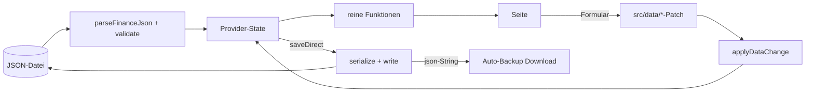

# Finance OS – Quick Reference

Kompaktes Nachschlagewerk für die tägliche Arbeit. Tiefe: [Knowledge Base](Finance_OS_Knowledge_Base.md) · Geschichte: [Development History](Finance_OS_Development_History.md) · Entscheidungen: [Decision Log](Finance_OS_Decision_Log.md).

## 1. Wichtigste Dateien

| Datei | Rolle |
|---|---|
| `src/types/finance.ts` | Alle Datentypen, `SUPPORTED_SCHEMA_VERSION = 1`, `WithUnknownFields` |
| `src/validation/validateFinanceData.ts` | Ladevalidierung Stufen A–D (Fehlercodes: data-model §5) |
| `src/validation/lockedDates.ts` | DM21: Schreibsperre für gesperrte Snapshot-Daten |
| `src/state/FinanceDataProvider.tsx` | Reducer, Laden/Speichern/Import, `todayIso`, beforeunload, Auto-Backup-Hook |
| `src/state/useFinanceData.ts` | Der eine Hook, den jede Seite benutzt |
| `src/state/localStoragePolicy.ts` | Allowlist: exakt `financeos.lastAutoBackupDay` |
| `src/finance/index.ts` | Barrel über alle reinen Formeln (F1–F22 + Modul-Bausteine) |
| `src/finance/wealth.ts` / `savings.ts` / `schedule.ts` | Vermögen (F1–F7) / Sparleistung (F8–F10) / Kalender+Aktivität |
| `src/finance/targets.ts` / `rebalancing.ts` / `goals.ts` / `projection.ts` | Zielvergleich+actionLevel / F17-F18+Analysen / Zielstatus / Simulation |
| `src/data/*.ts` | Reine Teil-Patch-Funktionen je Modul (K2-Byte-Identität) |
| `src/pages/*.tsx` | Die 9 Seiten; `src/layout/pages.ts` = Navigationsquelle |
| `src/storage/autoBackup.ts` | shouldAutoBackup + Tagesmerker (einziger localStorage-Nutzer) |
| `user-data/finance-data.example.json` | Seed/Startvorlage – **nie ändern** (Pins hängen daran) |
| `scripts/*.bat` + `*.ps1` | Dev-Workflow, Backup, Release (M16) |

## 2. Wichtigste Funktionen (statt „Klassen“ – das Projekt ist klassenlos funktional)

| Funktion | Zweck / Merksatz |
|---|---|
| `totalWealth`, `depotValue`, `cashValue` | F1/F2: GV = Tagesgeld + Depot; missingIds statt 0 |
| `ownMonthlySavings(plans, view)` | F8: eigene Sparleistung; view = 'realMonthly' \| 'smoothed' – nie mischen |
| `totalMonthlyInflow` | F9: Gesamtzufluss (inkl. employer/provider) |
| `actionLevel(deviationPp)` | 3 Stufen; Verkaufsoption nur bei ≥ +10 Pp |
| `calculateRebalancingAnalysis` | Die eine Abweichungsanalyse (auch Depot-Zielvergleich soll darauf konsolidiert werden, V1.x-13) |
| `proposeSavingsRates` | F17/F18: Budget proportional, floorToUnit, nie negativ |
| `deriveGoalStatus` | Statuskaskade; gespeichert wird nur Nutzerwille |
| `effectiveEmergencyFundTarget` / `effectiveGoalTarget` | DER wirksame Zielwert (Override > berechnet) – einzige Quelle |
| `simulateScenario` | Projektion; r=0 ≡ projectNoGrowth (Konsistenz-Pin) |
| `captureSnapshot` | Ganz-oder-gar-nichts-Snapshot mit 9 Fehlerstufen |
| `updateSettings` u. a. `src/data/`-Patches | Teil-Patch: undefined = nicht ändern; No-Op = Byte-identisch |
| `applyDataChange` (Provider) | Einziger Weg, Daten zu ändern (Dirty, DM21) |
| `shouldAutoBackup(mode, lastDay, today)` | undefined/everySave → true; dailyFirstSave → 1×/Tag |

## 3. Wichtigste Hooks

Nur einer: **`useFinanceData()`** – liefert `{ state, actions, todayIso }`. Es gibt bewusst keine weiteren Custom-Hooks mit Fachlogik; Seiten kombinieren reine Funktionen mit lokalem Formular-State.

## 4. Datenfluss

Merksätze: Zeit kommt aus `todayIso` (nie `new Date()` in Fachcode). Jede Änderung läuft durch `applyDataChange`. Das Backup bekommt exakt die geschriebenen Bytes.

## 5. Berechnungen – wo steht was?

| Frage | Quelle |
|---|---|
| Formel + Sollwert einer Kennzahl | `docs/calculation-rules.md` §12 (F1–F22) + Modul-Bausteine-Abschnitte |
| Warum zählt X (nicht) zur Sparleistung? | calculation-rules „Sparplan-Bausteine (M10)“, U3/U4 |
| Zielstatus-Rangfolge | calculation-rules „Ziel-Bausteine (M12)“ |
| Rebalancing-Schwellen/Budget | calculation-rules „Rebalancing-Bausteine (M11)“ |
| Projektionsmodell | calculation-rules „Simulations-Bausteine (M13)“ |
| Feld-/Validierungsregeln | `docs/data-model.md` §3/§5 |

## 6. Wo finde ich …?

| Suche | Ort |
|---|---|
| Fehlermeldungstext | grep in `src/validation/` (Ladezeit) bzw. `src/data/` (Schreibzeit) bzw. Seite (Formular) |
| einen Testfall zu Regel X | tests/ spiegelt src/; Kataloge T/DM/ST in den docs nennen die Erwartung |
| Navigations-/Seitenliste | `src/layout/pages.ts` (einzige Quelle) |
| Backup-/Release-Verhalten | `scripts/backup-project.ps1`, `scripts/release.ps1` (Kopfkommentare = Vertrag) |
| offene Punkte | `progress.md` „V1.x“ + `docs/V1_X_ROADMAP.md` |
| Bedienung | `docs/USER_GUIDE.md`, README |

## 7. Debugging

1. `scripts\start-dev.bat` (URL im Serverfenster; PID in `.runtime\dev-server.pid`; stoppen nur via `stop-dev.bat`).
2. Einzeltest: `npx vitest run tests/pfad/datei.test.tsx` – Seitentests laufen mit festem `FIXED_NOW`.
3. Ladefehler einer Datei: Die Fehlermeldung enthält Pfad + Ist-Wert; Code in validateFinanceData über den `E_*`-Code greppen.
4. „Warum ist Dirty an?“ – nur `applyDataChange` mit echtem Serialisat-Unterschied setzt Dirty; K2-Verstöße (materialisierte Defaults) sind die übliche Ursache.
5. Flake-Verdacht: erst isoliert laufen lassen; appLayout-„JEDER Seite“-Test hat dokumentiert 30-s-Timeout.
6. Kein Konsolen-Logging im Code – bewusst; temporäre Logs vor Commit entfernen (Lint/Review finden sie).

## 8. Häufige Änderungen – Rezepte

- **Neues optionales Datenfeld:** types → validate (additiv! Altdateien müssen laden) → data-Patch (K2: nie Default materialisieren) → UI → Tests (Rundreise + Negativ) → data-model §3 + **§6-Protokolleintrag**.
- **Neue Kennzahl:** Formel zuerst in calculation-rules mit Seed-Sollwert → reine Funktion + Pin-Test → Anzeige (unbekannt ≠ 0 beachten).
- **Neues Formularfeld:** SettingsPage-Muster kopieren (label/aria-describedby/B3-Fokusliste/Pflichtfeld-Legende) → Seitentest mit aria-Verdrahtung.
- **Text ändern:** grep in tests/ – viele Texte sind gepinnt; Pins bewusst mitziehen, nie abschwächen.
- **Neue Seite:** pages.ts erweitern; appLayout-Tests (9-Punkte-Pins!) anpassen – bewusste Entscheidung nötig.

## 9. Häufige Fragen

- **Warum sehe ich 0 € nicht?** Unbekannt ≠ 0 (G11) – leere Historie zeigt „unbekannt“.
- **Warum ändert Rebalancing nichts?** G1: Die App führt nie aus; Planungen sind „geplant, nicht ausgeführt“.
- **Warum kann ich X nicht löschen?** Kein-Löschen-Linie (Referenzen); deaktivieren/archivieren. Nur Simulationen sind löschbar.
- **Warum lädt meine alte Datei noch?** Alle Schema-Erweiterungen sind additiv; schemaVersion bleibt 1.
- **Warum 1170 im Bundle?** Dokumentierter Default der „Neue leere Datei“ (requirements M14); Ausweis in README.
- **Darf ich pushen/veröffentlichen?** Nein – privates Projekt; Remote nur auf ausdrückliche Nutzerentscheidung.
