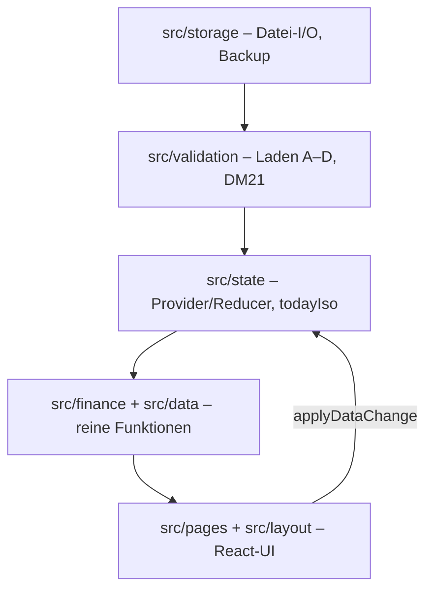

# Architecture

[Home](Home.md) · Verwandt: [Data-Model](Data-Model.md), [Storage](Storage.md), [Testing](Testing.md)

## Schichten

Regeln: keine Finanzlogik in React; kein `new Date()` in Fachcode (Zeit = injizierter `todayIso`); jede Datenänderung durch `applyDataChange` (Dirty-Status, DM21-Schutz); reine Funktionen mutieren nie.

## Bewusste Nicht-Dependencies

Nur `react`/`react-dom` zur Laufzeit. Kein Router (9 feste Seiten via `src/layout/pages.ts`), kein UI-Kit, keine Chart-Bibliothek (einziges Diagramm: handgerolltes Inline-SVG, nur Zusatz). Warum: Wartbarkeit, Auditierbarkeit, keine Update-/Lizenzrisiken ([Decision Log D7](../Finance_OS_Decision_Log.md)).

## Zustandsmodell

Ein Reducer im `FinanceDataProvider`: geladene Datei (+Handle), Dirty-Flag, isSaving-Sperre, pendingImport-Vorschau, Fehler-/Statusmeldungen. Der Hook `useFinanceData()` ist die einzige Schnittstelle der Seiten.

## Verzeichnisse

| Ordner | Inhalt |
|---|---|
| src/types | Datentypen, schemaVersion |
| src/validation | Ladevalidierung, lockedDates |
| src/storage | fileAccess, serializer, importFlow, autoBackup, emptyFile |
| src/state | Provider, Hook, localStorage-Allowlist |
| src/finance | F1–F22 + Modul-Bausteine (Barrel: index.ts) |
| src/data | Teil-Patch-Funktionen je Modul (K2) |
| src/pages, src/layout | 9 Seiten + Navigation |
| src/format | deutsche Formate |

Historie und Begründungen: [Development History §3](../Finance_OS_Development_History.md#3-architektur).
